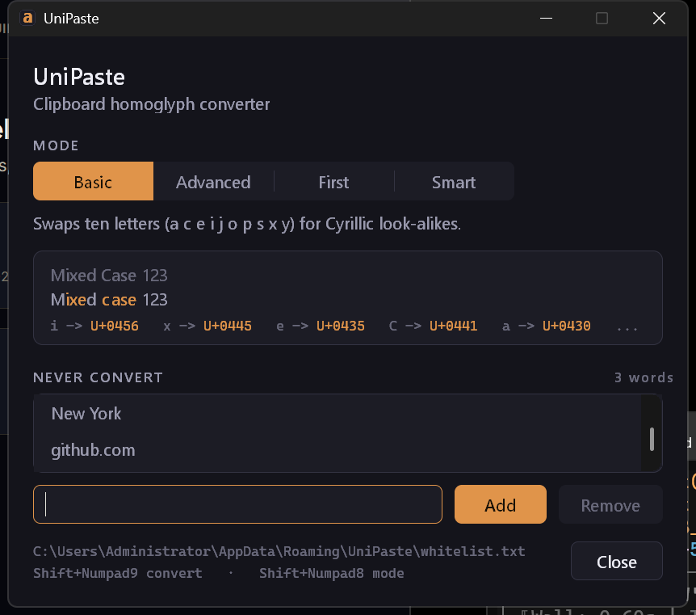

# UniPaste

A Windows tray utility that rewrites clipboard text into Unicode homoglyphs and pastes it with a single hotkey.

UniPaste reads whatever text is on the clipboard, substitutes selected Latin letters with visually
identical Cyrillic, Greek, Armenian and extended-Latin code points, writes the result back to the
clipboard and synthesises `Ctrl+V` into the window you were typing in. To a human reader the pasted
text is unchanged; to a naive keyword matcher, substring filter or exact-string blocklist it is a
different string, because `a` is now `U+0430 CYRILLIC SMALL LETTER A` and no longer `U+0061`.

It is a native C++17 Win32 application: plain Win32, GDI and common controls, no .NET, no Electron,
no Qt, no runtime redistributable. The Release build is a single statically-linked executable of
roughly 203 KB (207,872 bytes at the time of writing) that links only `user32`, `gdi32`, `shell32`,
`advapi32`, `comctl32`, `uxtheme` and `dwmapi`, with the CRT linked statically
(`MSVC_RUNTIME_LIBRARY = MultiThreaded`).

---

## Features

- **Global `Shift + Numpad9`** - convert the clipboard, put it back, paste it into the focused
  window, and flash a confirmation toast. Works in any application, no per-app integration.
- **Global `Shift + Numpad8`** - cycle the conversion mode `Basic -> Advanced -> First -> Smart -> Basic`
  without leaving the keyboard; the new mode is announced by a toast.
- **Four conversion modes** - `Basic`, `Advanced`, `First` and `Smart`, ported verbatim from the
  bundled browser tool (`index.html`).
- **Whitelist** - words and phrases that must never be converted (product names, URLs, identifiers,
  code snippets), managed from a settings GUI and stored as a plain text file.
- **Settings GUI** - a small native dialog for editing the whitelist and switching the active mode.
- **Toast notification** - a borderless, click-through, never-focus-stealing layered window in the
  top-right corner of the monitor holding the foreground window. Green accent on success, red on
  error (`Clipboard is busy`, `Clipboard has no text`, ...).
- **Tray icon** - right-click for the mode radio menu, `Settings...` and `Exit`.
- **Single instance** - guarded by a named mutex (`Local\UniPaste_SingleInstance`); launching a
  second copy shows a message box and exits.
- **Persistence**
  - Active mode: `HKCU\Software\UniPaste`, value `Mode`, `REG_DWORD` `0..3`.
  - Whitelist: `%APPDATA%\UniPaste\whitelist.txt`, UTF-8, one entry per line.

---

## Install / Build

### Prerequisites

| Requirement | Why |
| --- | --- |
| Windows 10 version 1703 or later | `SetProcessDpiAwarenessContext` / per-monitor DPI awareness v2. Earlier versions still run - the call is resolved dynamically and skipped when absent - but the toast is then sized DPI-unaware. |
| Visual Studio 2022 Build Tools with the **Desktop development with C++** workload (x64 MSVC toolset) | The project is MSVC-only (`/W4 /permissive- /utf-8`, static CRT via `CMP0091`). |
| CMake 3.20 or later | `cmake_minimum_required(VERSION 3.20)`. |
| Ninja (optional) | Preferred generator; the build script falls back to the Visual Studio generator when Ninja is missing. |

### One-shot build

```bat
build.bat
```

`build.bat` does the whole job from a plain `cmd.exe` - no "x64 Native Tools" prompt needed:

1. Locates `vswhere.exe` under `%ProgramFiles(x86)%\Microsoft Visual Studio\Installer`.
2. Queries it for the latest install that provides
   `Microsoft.VisualStudio.Component.VC.Tools.x86.x64`.
3. Calls that install's `VC\Auxiliary\Build\vcvars64.bat` to put the x64 toolset on `PATH`.
4. Configures with `cmake -S . -B build -G Ninja -DCMAKE_BUILD_TYPE=Release`.
5. If the Ninja configure fails, retries with `-G "Visual Studio 17 2022" -A x64`.
6. Builds with `cmake --build build --config Release` and reports the resulting executable path.

Each step aborts with a non-zero exit code and a diagnostic if it fails.

### Manual CMake

From a developer command prompt that already has the x64 toolset on `PATH`:

```bat
cmake -S . -B build -G Ninja -DCMAKE_BUILD_TYPE=Release
cmake --build build --config Release
```

or, with the multi-config Visual Studio generator:

```bat
cmake -S . -B build -G "Visual Studio 17 2022" -A x64
cmake --build build --config Release
```

### Output

- Ninja: `build\UniPaste.exe`
- Visual Studio generator: `build\Release\UniPaste.exe`

The executable is self-contained; copy it anywhere and run it. There is no installer and nothing is
written outside `HKCU\Software\UniPaste` and `%APPDATA%\UniPaste`.

---

## Usage

Run `UniPaste.exe`. It has no main window - it lives in the notification area.



### Hotkeys

| Hotkey | Action |
| --- | --- |
| `Shift + Numpad9` | Read the clipboard, convert it with the active mode, write it back, release the held modifiers and send `Ctrl+V` to the foreground window, then show the toast `Conversion successful`. On failure the toast turns red and names the problem instead. |
| `Shift + Numpad8` | Advance the conversion mode one step: `Basic -> Advanced -> First -> Smart -> Basic`. The new mode is saved to the registry immediately and announced by the toast `Mode: <name>`. Nothing is pasted. |

Both chords require the **numpad** keys. The grey `PageUp` and arrow `Up` keys are deliberately not
hijacked (see [Numpad vs navigation keys](#numpad-vs-navigation-keys)). NumLock may be on or off.

### Tray menu

Right-click the tray icon:

- **Settings...** - the default (bold) first item; opens the settings window (whitelist editor +
  mode selection).
- **Basic / Advanced / First / Smart** - radio group showing and setting the active mode.
- **Exit** - quits the application.

Double-clicking the tray icon opens the settings window directly.

The settings window is modeless: it can stay open while you keep using the hotkeys, and it refreshes
itself when the mode is changed from the tray menu or by `Shift + Numpad8`. Closing it does not quit
the application - use **Exit** for that.

### Settings window

A single dark surface, drawn rather than themed: the four modes are a segmented bar instead of a
drop-down, and the card under it is a **live specimen** of the active mode. It runs the sample
`Mixed Case 123` through the real converter - whitelist included - draws every substituted glyph in
amber against the unchanged characters, and lists the substitutions as `i -> U+0456` pairs in a
monospace face. Switching modes re-renders it, so the difference between `Basic` and `Advanced` is
visible before you convert anything.

Everything is keyboard operable. `Tab` reaches the segmented bar at the currently active cell;
`Left` / `Right` / `Up` / `Down` change the mode, `Home` and `End` jump to the ends. `Enter` in the
text field adds a word, `Delete` removes the selected one, `Esc` closes the window. The focused
control always carries a visible amber ring - the dotted system focus rectangle is not used.

The palette is a cool indigo-slate base (`#14141B` / `#1C1C25`) with a single warm amber accent
(`#E0944A`). Green and red are deliberately absent from the chrome: they are reserved for toast
status, so a colour in the window never competes with a colour that reports an outcome. Text is
rendered with grayscale antialiasing rather than ClearType, because subpixel fringes read as colour
noise on a dark background.

---

## Conversion modes

| Mode | Registry value | Behaviour |
| --- | --- | --- |
| **Basic** | `0` | Every character is looked up in the 10-letter Basic map. Letters with no entry pass through unchanged. |
| **Advanced** | `1` | Every character is looked up in the 25-letter Advanced map (`a`..`y`; there is no `z` entry in the source tables). Much more of the text changes, but some glyphs - notably `ſ` for `f` and `ո` for `n` - are less convincing at small sizes. |
| **First** | `2` | Index `0` uses the Advanced map; every remaining index uses the Basic map. Intended for defeating filters that anchor on the first character of a word. |
| **Smart** | `3` | If **both** of the first two characters are *unspoofable under Basic* (no Basic entry, i.e. not one of `a c e i j o p s x y`), those two characters use the Advanced map and the rest of the string uses Basic. Otherwise the whole string uses Basic. For a one-character input the single character uses Advanced when it is unspoofable under Basic. |

Substitution rule, identical in all four modes and inherited from the original web tool: the input
character is folded to lowercase with an ASCII-only fold, that lowercase letter is looked up in the
map, and the homoglyph is taken only when it differs from both the original character and its
lowercase form. Otherwise the original character is passed through untouched.

**Uppercase input therefore maps to the lowercase homoglyph** - `E` becomes `е` (`U+0435`), not an
uppercase Cyrillic `Е`. This is faithful to `index.html` and is intentional, not a bug; it does mean
mixed-case text loses its capitalisation on converted letters. Digits, punctuation, whitespace and
any character outside `a-z` / `A-Z` are never touched.

### Basic map (10 entries)

| Letter | Glyph | Code point | Unicode name |
| --- | --- | --- | --- |
| `a` | а | `U+0430` | CYRILLIC SMALL LETTER A |
| `c` | с | `U+0441` | CYRILLIC SMALL LETTER ES |
| `e` | е | `U+0435` | CYRILLIC SMALL LETTER IE |
| `i` | і | `U+0456` | CYRILLIC SMALL LETTER BYELORUSSIAN-UKRAINIAN I |
| `j` | ј | `U+0458` | CYRILLIC SMALL LETTER JE |
| `o` | о | `U+043E` | CYRILLIC SMALL LETTER O |
| `p` | р | `U+0440` | CYRILLIC SMALL LETTER ER |
| `s` | ѕ | `U+0455` | CYRILLIC SMALL LETTER DZE |
| `x` | х | `U+0445` | CYRILLIC SMALL LETTER HA |
| `y` | у | `U+0443` | CYRILLIC SMALL LETTER U |

`b d f g h k l m n q r t u v w z` have no Basic entry and are left alone.

### Advanced map (25 entries)

| Letter | Glyph | Code point | Unicode name |
| --- | --- | --- | --- |
| `a` | α | `U+03B1` | GREEK SMALL LETTER ALPHA |
| `b` | β | `U+03B2` | GREEK SMALL LETTER BETA |
| `c` | ϲ | `U+03F2` | GREEK LUNATE SIGMA SYMBOL |
| `d` | ԁ | `U+0501` | CYRILLIC SMALL LETTER KOMI DE |
| `e` | е | `U+0435` | CYRILLIC SMALL LETTER IE |
| `f` | ſ | `U+017F` | LATIN SMALL LETTER LONG S |
| `g` | ɡ | `U+0261` | LATIN SMALL LETTER SCRIPT G |
| `h` | һ | `U+04BB` | CYRILLIC SMALL LETTER SHHA |
| `i` | і | `U+0456` | CYRILLIC SMALL LETTER BYELORUSSIAN-UKRAINIAN I |
| `j` | ј | `U+0458` | CYRILLIC SMALL LETTER JE |
| `k` | κ | `U+03BA` | GREEK SMALL LETTER KAPPA |
| `l` | ӏ | `U+04CF` | CYRILLIC SMALL LETTER PALOCHKA |
| `m` | м | `U+043C` | CYRILLIC SMALL LETTER EM |
| `n` | ո | `U+0578` | ARMENIAN SMALL LETTER VO |
| `o` | о | `U+043E` | CYRILLIC SMALL LETTER O |
| `p` | р | `U+0440` | CYRILLIC SMALL LETTER ER |
| `q` | ԛ | `U+051B` | CYRILLIC SMALL LETTER QA |
| `r` | г | `U+0433` | CYRILLIC SMALL LETTER GHE |
| `s` | ѕ | `U+0455` | CYRILLIC SMALL LETTER DZE |
| `t` | т | `U+0442` | CYRILLIC SMALL LETTER TE |
| `u` | υ | `U+03C5` | GREEK SMALL LETTER UPSILON |
| `v` | ν | `U+03BD` | GREEK SMALL LETTER NU |
| `w` | ѡ | `U+0461` | CYRILLIC SMALL LETTER OMEGA |
| `x` | х | `U+0445` | CYRILLIC SMALL LETTER HA |
| `y` | у | `U+0443` | CYRILLIC SMALL LETTER U |

`z` has no entry in either map - the original JavaScript source has none, and the port keeps that
gap rather than inventing a glyph.

---

## Whitelist

Homoglyph substitution breaks anything that is parsed rather than read: URLs, e-mail addresses,
usernames, file paths, command lines, product names, API keys. The whitelist is the escape hatch -
a list of words and phrases that keep their original code points no matter which mode is active.
Everything around them is still converted.

### Matching rules

- **Case-insensitive**, using the same ASCII-only fold as the converter (`A-Z` only; a whitelist
  entry `GitHub` protects `github`, `GITHUB` and `GitHub`).
- **Word-boundary anchored at both ends.** An entry only matches when the character immediately
  before and immediately after the match is not a word character, so `cat` protects `cat` and
  `the cat sat` but not `concatenate`, `cats` or `bobcat`.
- **Word characters** are `A-Z`, `a-z`, `0-9`, `_` and *any* code unit `>= 0x80`. Treating all
  non-ASCII as word characters means an already-converted homoglyph counts as part of a word, so a
  boundary is never found in the middle of previously converted text.
- **Phrases are allowed.** An entry may contain spaces and punctuation; `Visual Studio` protects the
  whole two-word phrase. Matching is on the literal sequence, so the spacing must line up.
- Overlapping entries never double-mark: at each position the longest matching entry wins and the
  scan resumes after it, so `New` and `New York` together protect `New York` as one span.
- Protection is per code unit, applied as a mask handed to the converter, so a partially protected
  line converts everything outside the protected spans normally.

### Storage

The list lives in:

```text
%APPDATA%\UniPaste\whitelist.txt
```

It is a plain UTF-8 text file, safe to edit by hand or keep under version control:

```text
# Lines starting with '#' are comments.
# One entry per line; leading and trailing whitespace is trimmed.
GitHub
Visual Studio
api.example.com
UniPaste
```

- One entry per line.
- Blank lines are ignored.
- A line whose first non-space character is `#` is a comment.
- Duplicate entries are rejected when added through the GUI.
- A missing file is not an error - it simply means an empty whitelist.

The settings window writes the file whenever the list changes, so hand edits made while the
application is running should be followed by a restart (or a reopen of the settings window) to avoid
being overwritten.

---

## How it works

### Why not `RegisterHotKey`

The obvious implementation - `RegisterHotKey(hwnd, id, MOD_SHIFT, VK_NUMPAD9)` - **silently never
fires** while NumLock is on. The keyboard layer implements "shift cancels NumLock" by fabricating a
Shift *release* immediately before the numpad key is delivered, and re-injecting the Shift press
after it is released. By the time the numpad key reaches the hotkey matcher, the system's view of the
modifier state has no Shift in it, so `MOD_SHIFT` cannot match. The fabricated events are
distinguishable: their scan code carries bit `0x200`.

A low-level trace of pressing `Shift + Numpad9` with NumLock on:

```text
DN vk=0xA0 scan=0x02A   Shift down
UP vk=0xA0 scan=0x22A   <- OS fake-shift release (bit 0x200)
DN vk=0x21 scan=0x049   numpad 9 arrives as VK_PRIOR
```

UniPaste therefore drives its hotkeys from a `WH_KEYBOARD_LL` hook that tracks the *physical* Shift
state itself, updating it only for Shift events whose scan code does **not** have `0x200` set, and
ignoring the fake ones entirely. `RegisterHotKey` is still used, but only as a fallback for the case
where the hook cannot be installed at all; in that degraded mode the chord works with NumLock off.

The app also swallows the triggering key-down and its matching key-up (`return 1` from the hook), so
the target window never receives a stray `9` or `PageUp`.

### Low-level hook on its own thread

Windows silently unhooks a `WH_KEYBOARD_LL` callback that cannot answer within
`LowLevelHooksTimeout` (~300 ms by default). The hotkey handler blocks for exactly that order of
magnitude: up to 10 clipboard-open retries at 20 ms each, a 30 ms settle delay, and the `SendInput`
batch - and those synthesised keystrokes are themselves events the hook is asked to inspect. Running
the hook on the UI thread would mean the hook dies the first time it is used.

The hook therefore lives on a dedicated thread whose only job is to pump messages. The installer
creates the thread, the thread calls `SetWindowsHookExW`, forces its message queue into existence
with a `PeekMessageW` and signals a ready event before the installer proceeds; teardown posts
`WM_QUIT` to that thread. The callback itself does nothing but bookkeeping plus a `PostMessageW` to
the hidden main window, so it always returns immediately and the actual work happens on the UI
thread.

Injected events are stamped with `dwExtraInfo = 0x554E4950` (`'UNIP'`) so the hook can recognise the
application's own synthesis and pass it straight through.

### Atomic paste

When the hotkey fires, Shift (and usually the numpad key) are still physically held. Sending a plain
`Ctrl+V` at that moment reaches the target as `Ctrl+Shift+V` - which is "paste without formatting" in
some apps and nothing at all in others.

Releasing Shift first in a *separate* `SendInput` call does not fix it. When the numpad key comes up,
the keyboard layer restores the Shift it had cancelled by injecting a fresh Shift **press**, which
can land between our release and our `Ctrl+V`, turning the paste back into `Ctrl+Shift+V`. The race
is real and intermittent, which is the worst kind.

`SendInput` guarantees that one array is inserted into the input stream serially, with no foreign
events interleaved. So the modifier releases and the paste travel as a **single batch**: release
`VK_LSHIFT`, `VK_RSHIFT`, `VK_SHIFT`, release the trigger key if it still needs it, release Win and
Alt if they happen to be down, then `Ctrl` down, `V` down, `V` up, `Ctrl` up. A 30 ms sleep before
the batch lets the user's own key-up storm drain first.

### Numpad vs navigation keys

With NumLock on and Shift held, numpad 9 and numpad 8 do not report as `VK_NUMPAD9` / `VK_NUMPAD8` -
they report as `VK_PRIOR` (`0x21`) and `VK_UP` (`0x26`), the navigation meanings. They keep the
numpad's own scan codes though, and those are **non-extended**:

| Physical key | Virtual key under Shift | Scan code | Extended flag |
| --- | --- | --- | --- |
| Numpad 9 | `VK_PRIOR` | `0x49` | no |
| Grey PageUp | `VK_PRIOR` | `0x49` | **yes** (`0xE0 0x49`) |
| Numpad 8 | `VK_UP` | `0x48` | no |
| Grey arrow Up | `VK_UP` | `0x48` | **yes** (`0xE0 0x48`) |

The hook matches on virtual key **plus** scan code **plus** the absence of `LLKHF_EXTENDED`, so
`Shift + PageUp` and `Shift + Up` on the navigation cluster - i.e. ordinary text selection - keep
working exactly as they always did. The same asymmetry is respected on the way out: the synthetic
key-up for the trigger is sent without `KEYEVENTF_EXTENDEDKEY`, because the key being released is the
numpad one.

### Toast rendering

The notification is a `WS_EX_LAYERED | WS_EX_TRANSPARENT | WS_EX_TOOLWINDOW | WS_EX_NOACTIVATE`
window updated through `UpdateLayeredWindow` from a 32-bit top-down `CreateDIBSection` surface, with
per-pixel premultiplied alpha. Two details make that harder than it sounds:

- **GDI destroys the alpha channel.** `FillRect`, `RoundRect` and especially `DrawTextW` write RGB
  and leave the alpha byte at zero, which `UpdateLayeredWindow` reads as fully transparent - the card
  would be invisible. So the whole buffer is post-processed after drawing: alpha is forced to `255`
  inside the rounded card (the colours are opaque, so premultiplied equals straight there) and the
  pixel is zeroed outside it. Corner pixels get coverage-scaled alpha computed by a 3x3 supersample
  of the rounded-rect predicate, then premultiplied - that is what gives the card smooth,
  non-jagged corners without any external graphics library. Straight edges take an analytic fast
  path; only the four corner boxes pay for the supersampling.
- **DPI comes from the monitor, not the foreground window.** `GetDpiForWindow` reports the DPI
  *context* of the window it is given, which is a flat 96 for a DPI-unaware process. The foreground
  window belongs to someone else, so asking it would size the toast according to a foreign
  application's manifest - a 96-dpi card on a 144-dpi screen. Instead the foreground window is used
  only to pick *which* monitor (`MonitorFromWindow`), and the effective DPI of that monitor is read
  with `GetDpiForMonitor` (resolved dynamically from `shcore.dll`, with `GetDpiForWindow` on the
  toast's own per-monitor-aware window and finally `GetDeviceCaps(LOGPIXELSX)` as fallbacks).

Animation is a single 16 ms timer driving a 140 ms fade-and-slide in, a 1400 ms hold and a 260 ms
fade out; the fade itself is carried by `BLENDFUNCTION::SourceConstantAlpha`, so the expensive
per-pixel render happens once per toast rather than once per frame. The window is anchored to the
top-right corner of the monitor's *work area*, so it never sits under the taskbar.

---

## Project layout

```text
UniPaste/
├── CMakeLists.txt      Build definition: C++17, /W4 /permissive- /utf-8, static CRT, WIN32 subsystem.
├── build.bat           vswhere -> vcvars64 -> CMake (Ninja, falling back to VS 17 2022) -> build.
├── index.html          The original single-file browser tool this app was ported from; the Basic
│                       and Advanced substitution tables come from its unicodeConverter() maps.
│                       Kept verbatim as the reference implementation - do not edit.
├── README.md           This document.
├── docs/
│   └── settings.png    Screenshot of the settings window used above.
└── src/
    ├── main.cpp        wWinMain, single-instance mutex, hidden UniPasteMain window, tray icon and
    │                   menu, WH_KEYBOARD_LL hook on its own pump thread, clipboard read/write with
    │                   retries, atomic SendInput paste, registry-backed mode.
    ├── spoof.h         Mode enum, Convert() with the protected-span mask, ModeName(), NextMode().
    ├── spoof.cpp       The two homoglyph tables and the four mode algorithms.
    ├── overlay.h       Toast API: Init / Show(text, Kind) / Shutdown.
    ├── overlay.cpp     Layered-window toast: DIB surface, rounded-card rasteriser with antialiased
    │                   corners, per-monitor DPI scaling, fade/slide animation.
    ├── whitelist.h     Whitelist API: Entries / Add / RemoveAt / Load / Save / FilePath / Mark.
    ├── whitelist.cpp   Whitelist storage (%APPDATA%\UniPaste\whitelist.txt) and the word-boundary,
    │                   case-insensitive matcher that builds the protected-span mask.
    ├── theme.h         Design tokens (palette, six font roles) and the drawing API.
    ├── theme.cpp       Font cache, dark title bar, and an offscreen BGRA canvas with antialiased
    │                   rounded-rectangle fills and strokes - GDI has no antialiased primitives, so
    │                   coverage is supersampled and blended per pixel.
    ├── appicon.h       Icon API: Get(px) / Shutdown.
    ├── appicon.cpp     Generates the app icon at runtime - a Cyrillic small a (U+0430) in amber on
    │                   a rounded tile. The mark is the product: it reads as a Latin 'a' but is the
    │                   substituted character.
    ├── settings.h      Settings window API: Init / Show / NotifyModeChanged / Shutdown /
    │                   HandleDialogMessage.
    └── settings.cpp    The settings GUI: segmented mode bar, live specimen card, owner-drawn
                        whitelist list, and the add/remove controls, kept in sync with the tray
                        menu and the mode-cycle hotkey.
```

---

## Credits

The Basic and Advanced substitution tables, the `spoofChar` lookup semantics (including the
lowercase-only mapping) and the `First` / `Smart` mode definitions all originate from the bundled
`index.html`, a self-contained Alpine.js + Tailwind browser tool. UniPaste is a native port of that
tool with a global hotkey, a whitelist and a tray UI on top; the conversion output is intended to be
byte-for-byte identical to the web version for the same input and mode.

## License

MIT License

Copyright (c) 2026 Nou4r

Permission is hereby granted, free of charge, to any person obtaining a copy
of this software and associated documentation files (the "Software"), to deal
in the Software without restriction, including without limitation the rights
to use, copy, modify, merge, publish, distribute, sublicense, and/or sell
copies of the Software, and to permit persons to whom the Software is
furnished to do so, subject to the following conditions:

The above copyright notice and this permission notice shall be included in all
copies or substantial portions of the Software.

THE SOFTWARE IS PROVIDED "AS IS", WITHOUT WARRANTY OF ANY KIND, EXPRESS OR
IMPLIED, INCLUDING BUT NOT LIMITED TO THE WARRANTIES OF MERCHANTABILITY,
FITNESS FOR A PARTICULAR PURPOSE AND NONINFRINGEMENT. IN NO EVENT SHALL THE
AUTHORS OR COPYRIGHT HOLDERS BE LIABLE FOR ANY CLAIM, DAMAGES OR OTHER
LIABILITY, WHETHER IN AN ACTION OF CONTRACT, TORT OR OTHERWISE, ARISING FROM,
OUT OF OR IN CONNECTION WITH THE SOFTWARE OR THE USE OR OTHER DEALINGS IN THE
SOFTWARE.
